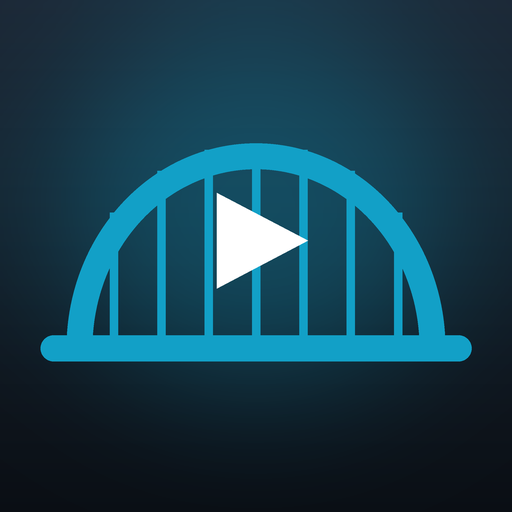
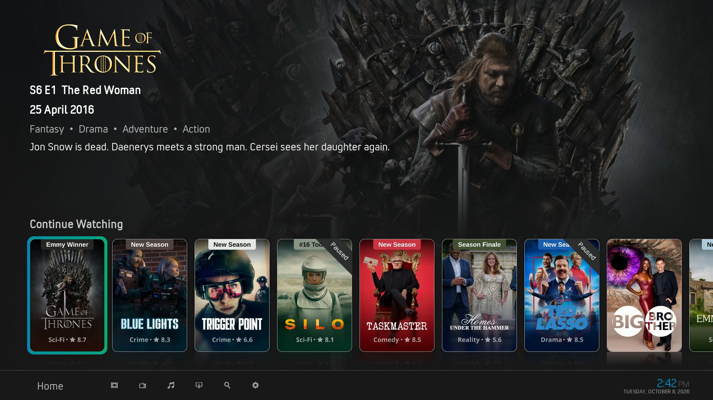
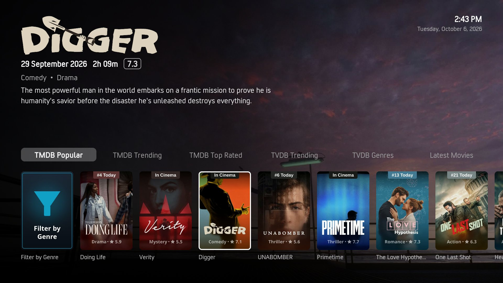
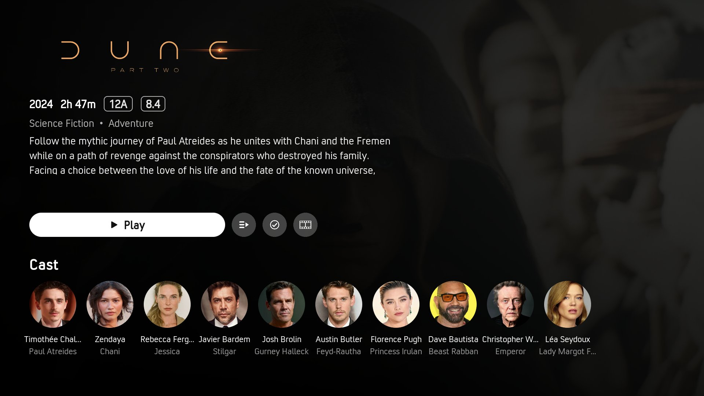
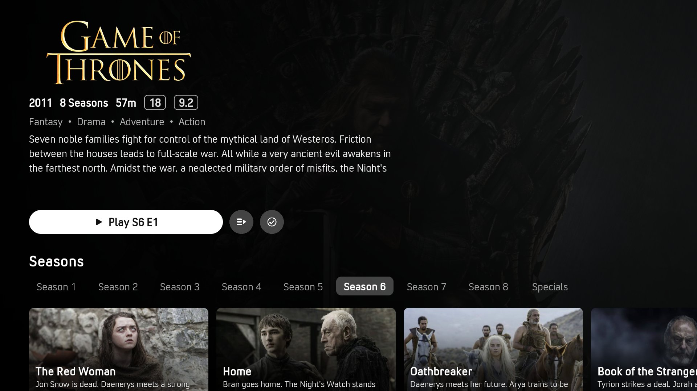
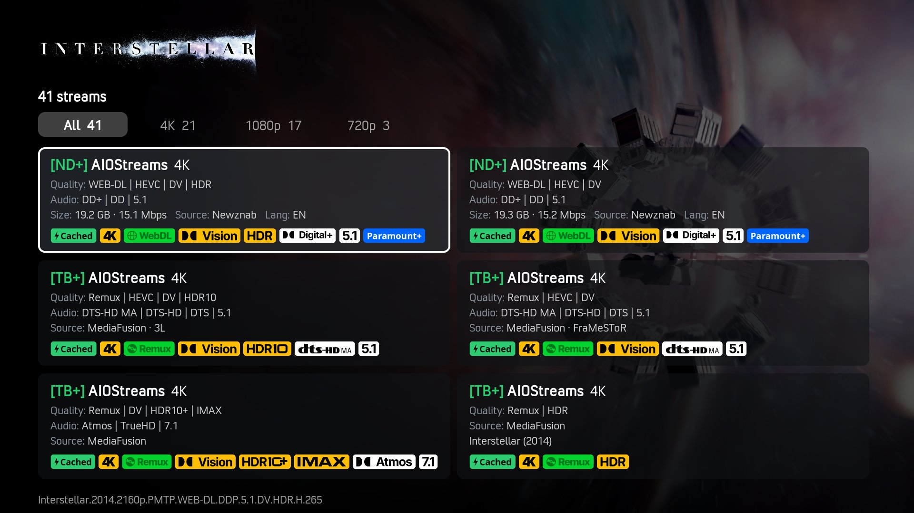
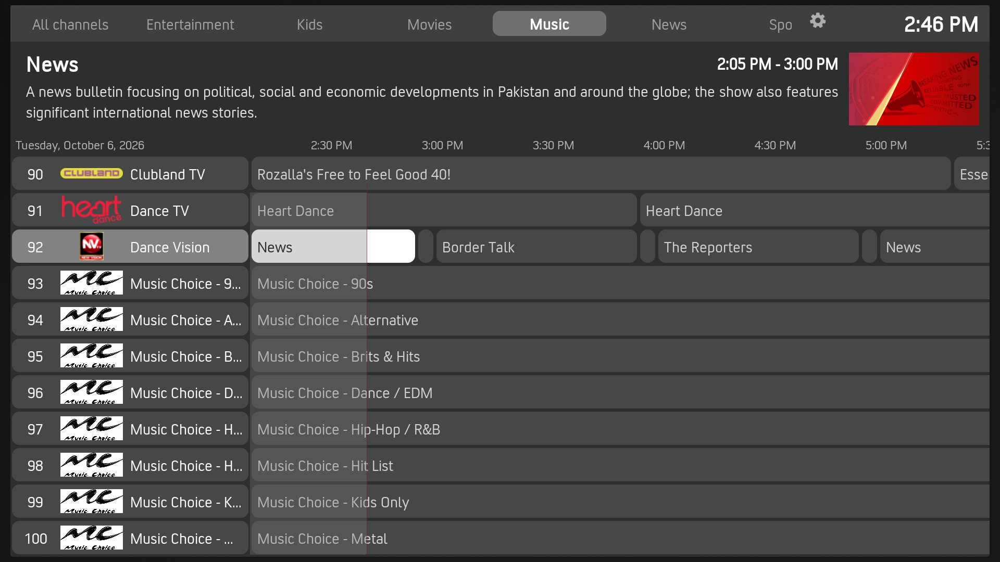
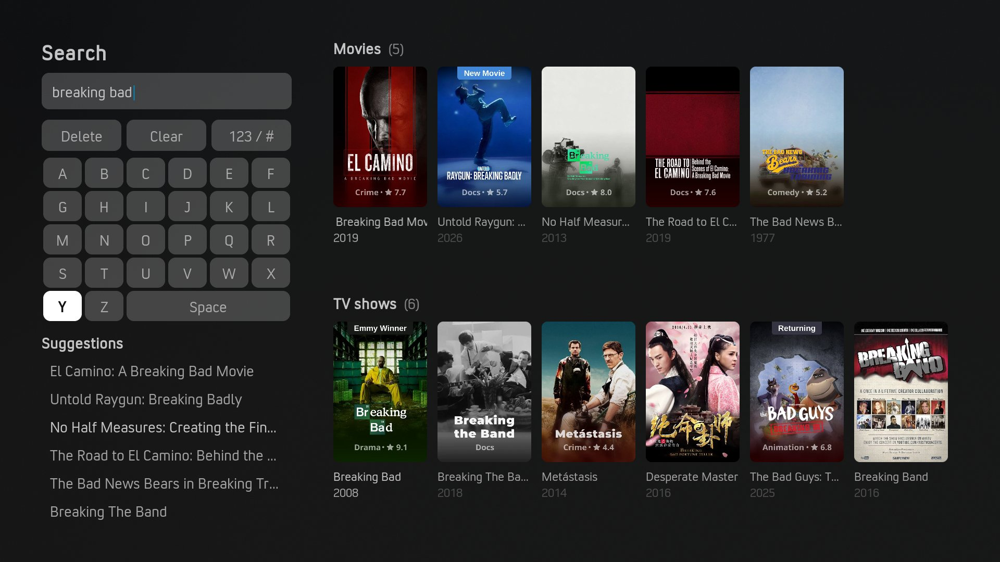

# Stremio addons in Kodi



Use the Stremio addons you already have (AIOStreams, AIOMetadata, Torrentio, Cinemeta and the
rest) in Kodi, with your remote, on any device Kodi runs on. There are two ways to do it, from
the same repository:

- **Stremio Bridge** (`plugin.video.stremiobridge`) is a video add-on. Paste in your addons'
  manifest URLs, then browse their catalogs, read their metadata, play their streams and load their
  subtitles **in the skin you already use**, with home-screen widgets and Kodi's own views.
- **Arctic Zephyr Stremio** (`skin.arctic.zephyr.stremio`) is a **complete Kodi front end** built
  on Stremio Bridge: a Netflix-style home, Movies and TV Shows hubs, its own info, stream, search
  and player screens, and a setup wizard that takes you from a fresh Kodi to watching in a few
  steps.

Both are bridges, not sources: they provide no content of their own. Everything comes from the
Stremio addons you install. Both need **Kodi 21 Omega or later**.

[](https://ko-fi.com/shiggsy365)

| | |
|---|---|
| <br>Home | <br>Movies hub |
| <br>Movie info page | <br>Series info page, with the season and episode browser |
| <br>Available streams | <br>TV guide |
| <br>Search as you type | |

*Screenshots: Arctic Zephyr Stremio.*

## Which one?

| | Stremio Bridge in your skin | Arctic Zephyr Stremio |
|---|---|---|
| **For** | Keeping the skin you have, or adding Stremio addons alongside your library and other add-ons | A Kodi set up for streaming from Stremio addons and little else |
| **Installs** | Stremio Bridge | The skin, with Stremio Bridge, YouTube (trailers) and Up Next (next episode) |
| **Browsing** | Stremio Bridge's front page and hubs in Videos → Add-ons, plus widgets you add to your skin | Home rows and Movies and TV Shows hubs, ready filled with your catalogs |
| **Info, streams, search, player** | Stremio Bridge's own windows, and your skin's player | The skin's pages, in one style throughout |
| **Setup** | Settings → Addons | A setup wizard on first start |

Everything in the first column is also in the second: the skin uses Stremio Bridge for all of it.

## Stremio Bridge

- **Any number of Stremio addons.** Add them by manifest URL (configured URLs keep their
  settings), then reorder, enable or disable them. Each addon is asked for what it supports:
  catalogs, metadata, streams and subtitles.
- **Catalogs, organised.** The front page shows Continue Watching, Next Up and your Watchlist, then
  **Movies, TV Shows, Anime and More** hubs, each with Search and Genres. *Organise catalogs* lets
  you reorder, rename, hide and pin catalogs, move them between hubs, and make hubs of your own.
- **Proper show pages.** Shows, seasons and episodes, with artwork, cast photos, trailers and
  unaired episodes greyed out. Shows open on the next episode you haven't watched.
- **Extended info.** An info page with clickable cast (to find their other work), Play/Resume,
  Trailer, Similar titles, an Overall Rating, Mark watched, and Add to library or watchlist.
- **Streams your way.** Everything your stream addons find, fetched in parallel and sorted, on a
  page of cards with badges (resolution, release, Dolby Vision/HDR, audio, channels, streaming
  service, cached) and filters. Or turn on autoplay: it checks streams in order until one works,
  and if one fails after it starts, it moves on to the next.
- **Search.** One search across every search catalog, a row of results per catalog. People too.
- **Watch state.** Resume points, watched ticks, Continue Watching and Next Up, with time left and
  "5 of 10 watched". Mark a movie, episode, season or whole show watched.
- **Home-screen widgets.** A Widgets folder of ready-made sources that refresh after you watch
  something. Next Page in a widget loads the next page into the same row.
- **Kodi's library (optional).** Add movies and shows to Kodi's Movies and TV Shows library.
  Followed shows pick up new episodes daily.
- **Fits your skin.** Pick a default view for movie, show, season and episode lists from the views
  your skin offers, with previews.
- **Back stops playback** (setting, on by default): Back in full-screen video stops it, as the Stop
  button does, instead of leaving it playing behind the menus.

## Arctic Zephyr Stremio

A fork of Arctic: Zephyr - Reloaded, rebuilt around Stremio Bridge (no TMDb Helper or Embuary).

- **Setup wizard** on first start: your MDBList API key, then your Stremio addons one by one. Run it
  again any time from *Settings*.
- **Home:** the focused title's artwork, logo, release date, genres and plot over rows of rounded
  posters. Continue Watching and your watchlist out of the box; add any catalog as a row.
  A slim menu bar (Home, Movies, TV Shows, Music, Live TV, Search, Settings) shows icons and opens to
  the name of the item in focus, with the clock beside it. With more than one Kodi profile, the
  profile's picture and name sit beside the clock; select it to switch profile.
- **Movies and TV Shows hubs:** your catalogs as chips over one row of posters. Only the chip you
  pick is loaded. Rows page in place (Next and Previous Page) and can be filtered by genre without
  leaving the hub. Stremio Bridge keeps the chips in step with your catalogs.
- **One info page** for movies, shows, seasons and episodes: full-screen artwork, logo, facts with
  age-rating and rating pills, a scrolling plot, then Play (or *Play S1 E3* / *Resume*) with
  Available streams, Watched, Watchlist and Trailer. Shows get season tabs and episode cards with
  the details on the image; the page follows the episode you're on. Then cast and similar titles.
- **Available streams:** cards in two columns with badges and filter chips (by resolution).
- **Search as you type:** an on-screen keyboard with live rows of movie and TV results, suggestions
  and recent searches.
- **Video player:** a banner with the logo, facts and plot, and a bar with the transport buttons,
  Audio, Video and Subtitles icons, and when the film finishes. Pausing brings the buttons up.
- **TV guide** in the same style, with channel groups as tabs.
- **Fast on a Fire TV Stick:** images packed into Kodi's texture format, only the views it uses,
  and the old Arctic Zephyr pages it replaced removed.

With this skin, Stremio Bridge's library integration is off: the skin's menus show your catalogs
directly. Licensed CC BY-NC-SA 3.0 like the original; credits in its `CREDITS.md`.

## The best setup

Either way works with any Stremio addon, but they were built around one combination:

| | What it brings |
|---|---|
| **[AIOMetadata](https://github.com/cedya77/aiometadata)** (Stremio addon) | Catalogs and metadata from TMDB, TVDB, MDBList, AniList and more, in one addon you configure on its website: trending, streaming-service and genre catalogs, anime, artwork, logos, cast photos, trailers and people search. |
| **[AIOStreams](https://github.com/Viren070/AIOStreams)** (Stremio addon) | Streams from many scrapers and your debrid or Usenet service, combined, filtered and sorted into one list. Its direct links play straight away in Kodi, which suits autoplay. See [the formatter](#aiostreams-formatter) below. |
| **[MDBList](https://mdblist.com)** (free account) | Watched history, resume points and a watchlist shared with your other devices, plus ratings and similar titles. |
| **[Up Next](https://github.com/im85288/service.upnext)** (Kodi add-on) | The "Next episode" pop-up near the end of an episode. Stremio Bridge hands it the next episode, from the same source (AIOStreams' `bingeGroup`). Installed with the skin. |

AIOMetadata fills the hubs and show pages, AIOStreams supplies the streams, MDBList keeps your watch
history in step across devices, and Up Next takes you from one episode to the next. In Stremio
Bridge's settings, also turn on *Play the best stream automatically* (Playback) and *Include next
episodes in Continue Watching* (Watch state).

Cinemeta (Stremio's own metadata addon) is the fallback for metadata, and any other Stremio
catalog, stream or subtitle addon works alongside these.

### Why MDBList

Both work without it, but a free [MDBList](https://mdblist.com) API key (*mdblist.com →
Preferences → API access*) unlocks most of what makes them feel complete:

- **Watched history everywhere.** What you watch is scrobbled to MDBList as it plays, and what you
  watched elsewhere (other Kodi devices, Stremio, Nuvio, the website) comes back.
- **Resume on any device.** Stop a film on one device and carry on from the same point on another.
- **Overall Rating:** IMDb, Rotten Tomatoes, Metacritic, Trakt, TMDB, Letterboxd and Roger Ebert,
  each scaled to 100 and averaged with MDBList's own score.
- **Similar titles** from MDBList's recommendations.
- **A watchlist**, on the front page or the skin's home, kept in step with MDBList.

Without it, watched state and resume points stay on one device, and ratings, similar titles and
the watchlist are hidden.

### AIOStreams formatter

Stremio Bridge's stream cards and badges need AIOStreams to describe each stream in a fixed
format: one `key: value` per line. Without it, Stremio Bridge falls back to reading AIOStreams'
decorated text (small capitals, symbols) as best it can, and badges can be missing or wrong. It
uses the fixed format whenever a stream's description has at least three of these keys:

| Key | Meaning | Example |
|---|---|---|
| `res` | resolution | `2160p` |
| `src` | release | `WEB-DL`, `BluRay REMUX` |
| `vis` | visual tags | `DV, HDR10+` |
| `aud` | audio tags | `TrueHD, Atmos` |
| `ch` | channels | `7.1` |
| `size`, `br` | size, bitrate | `19.2 GB`, `15.1 Mbps` |
| `svc`, `cached` | debrid/Usenet service, cached | `RD`, `yes` |
| `type` | stream type (`p2p` marks a torrent) | `debrid` |
| `prov`, `grp`, `lang` | where it's from, release group, languages | `NZBgeek`, `FLUX`, `EN` |
| `net` | streaming service | `Netflix` |

In AIOStreams, open **Formatter** and choose **Custom**. The name can be anything; for example:

**Name**

```
{?[{service.shortName}] ?}{addon.name} {?{stream.resolution}?}
```

**Description** (required)

```
{?res: {stream.resolution}?}
{?src: {stream.quality}?}
{?vis: {stream.visualTags::join(', ')}?}
{?aud: {stream.audioTags::join(', ')}?}
{?ch: {stream.audioChannels::join(', ')}?}
{?size: {stream.size::bytes}?}
{?br: {stream.bitrate::bitrate}?}
{?svc: {service.shortName}?}
cached: {service.cached::istrue["yes"||"no"]}
type: {stream.type}
{?prov: {stream.indexer}?}
{?grp: {stream.releaseGroup}?}
{?lang: {stream.languageCodes::join(', ')}?}
{?net: {stream.network}?}
```

A stream then arrives as, for example:

```
res: 2160p
src: WEB-DL
vis: DV, HDR
aud: DD+
ch: 5.1
size: 19.2 GB
br: 15.1 Mbps
svc: TB
cached: yes
type: debrid
grp: FLUX
lang: EN
net: Paramount+
```

and its card shows 4K, WEB-DL, Dolby Vision, HDR, DD+, 5.1, Paramount+ and cached badges, with the
size, bitrate, group and language in its text. Lines with nothing to fill in are left out. The
stream cards are Stremio Bridge's, so this applies in any skin.

## Installing

Install from the repository, so updates arrive automatically:

1. In Kodi, go to **Settings → System → Add-ons** and turn on **Unknown sources**.
2. Go to **Settings → File manager → Add source**, enter
   `https://shiggsy365.github.io/KodiStremioBridge/` and name it `shiggsy365`.
3. Go to **Add-ons → Install from zip file → shiggsy365** and pick `repository.shiggsy365-x.y.z.zip`.
4. Then either:
   - **Stremio Bridge:** **Add-ons → Install from repository → shiggsy365 Repository → Video
     add-ons → Stremio Bridge**. For the pop-up between episodes, also install **Up Next** from the
     official Kodi repository.
   - **Arctic Zephyr Stremio:** **Add-ons → Install from repository → shiggsy365 Repository → Look
     and feel → Skin → Arctic Zephyr Stremio**, then switch to it when Kodi asks. Stremio Bridge,
     YouTube and Up Next are installed with it.

## Getting started

### With Arctic Zephyr Stremio

The setup wizard opens on the skin's first start:

1. **MDBList API key** (*Skip*, *Enter*, *Cancel setup*).
2. **A Stremio addon**: paste a manifest URL ending in `/manifest.json`, such as your configured
   AIOStreams (*Enter*, *Cancel setup*).
3. **Another addon?** (*Skip*, *Enter*, *Cancel setup*), until you skip: add AIOMetadata, subtitle
   addons and anything else.

The skin then reloads with your catalogs in the Movies and TV Shows hubs. Change the home rows and
menu under *Settings → Skin → Customise home menu*, and Stremio Bridge's settings under *Settings →
Add-ons → Stremio Bridge*.

### With your own skin

1. **Add your addons:** in Stremio Bridge's settings, **Addons → Manage addons → Add addon…**,
   and paste each manifest URL. (*Addons → Run setup wizard* walks through the same steps as the
   skin's wizard.)
2. **Connect MDBList** (recommended): **Settings → MDBList**, then paste your API key.
3. **Arrange the catalogs:** **Settings → Addons → Organise catalogs**. Use the context menu on a
   catalog to show, hide, rename, move or pin it, or on a hub to create, rename or remove hubs.
4. **Widgets:** in your skin's widget picker, browse to **Add-ons → Stremio Bridge → Widgets** and
   pick Continue Watching, Next Up, Watchlist or any catalog. These refresh after you watch
   something. (If the folder isn't there, turn on *Show the Widgets folder on the front page*
   under **Settings → Metadata**.)
5. **Views** (optional): **Settings → Views**. Pick the view your skin uses for movie, show,
   season and episode lists.
6. **Library** (optional): **Settings → Library → Set up library** adds two video sources and
   restarts Kodi. Then, in **Videos → Files**, set the content of "Stremio Bridge Movies" to Movies
   and "Stremio Bridge TV" to TV shows, once. Add titles with *Add to library*.

Your addons and settings are stored in `special://profile/addon_data/plugin.video.stremiobridge/`.
Configured addon URLs often contain account tokens, so Stremio Bridge never writes them, or stream
links, to Kodi's log.

### Several people, several profiles

Give each person a Kodi profile, and each gets their own Stremio Bridge: addons, catalogs,
settings, MDBList account, watch history, Continue Watching and Next Up. Kodi keeps a separate
`special://profile/` for each profile, so there's nothing to share or copy.

1. **Add the profiles:** **Settings → Profiles → Add profile…**. Under **Settings → Profiles →
   General**, turn on *Show login screen on startup* so Kodi asks who's watching.
2. **Set each one up:** log in as the new profile and add its addons, as in *Getting started*.
   (With Arctic Zephyr Stremio, the setup wizard runs at the profile's first start; run it again any
   time from *Settings*.)
3. **Choose each profile's home widgets:** while logged in as that profile, go to *Settings → Skin →
   Customise home menu*, pick **Home**, **Movies** or **TV Shows**, and choose a list for each
   widget, for example from **Add-ons → Stremio Bridge → Widgets**. Do the same in each profile.

With Arctic Zephyr Stremio, switching profiles is quick: select the profile picker beside the clock,
pick a profile, and the home screen opens once, with that profile's widgets. After you change a
widget, the home menu is rebuilt once (the home screen reloads), and from then on each profile shows
its own choice. Two things are shared by all profiles, because Skin Shortcuts keeps one home menu for
them all: how many widget rows Home, Movies and TV Shows have (and their layout), and the widgets of
any other menu items you add.

With your own skin, Stremio Bridge's lists are still each profile's own, but whether each profile
can have different widgets depends on how your skin stores them. Skins using Skin Shortcuts share
one home menu between profiles.

## Also in the repository: Dispatcharr Bridge

**Dispatcharr Bridge** (`script.shiggsy365.dispatcharrbridge`) is for live TV in IPTV Simple served by
[Dispatcharr](https://github.com/Dispatcharr/Dispatcharr). While watching a channel, **hold
OK/Select** to see its source streams (with M3U account, resolution, codec and bitrate, the current
one marked) and switch to another, or let Dispatcharr try the next one. *Choose source (Dispatcharr)*
does the same from a channel's or guide entry's context menu.

The switch happens on Dispatcharr's server, so Kodi keeps playing the same channel with its guide
and channel info. Settings: an admin user's Dispatcharr API key, and the address (found from IPTV
Simple's playlist if left empty). Switching affects everyone watching that channel, and the
channel's source order in Dispatcharr is unchanged.

## Credits

The stream badges come from a Nuvio badge configuration shared by saif1233, with images from
[BetterFormatter](https://github.com/9mousaa/BetterFormatter) and
[Omni-Template-Bot-Bid-Raiser](https://github.com/nobnobz/Omni-Template-Bot-Bid-Raiser); see
`tools/badges/nuvio/SOURCES.md`. Dolby, DTS and IMAX logos belong to their owners. Arctic Zephyr
Stremio is based on Arctic: Zephyr - Reloaded by jurialmunkey and beatmasterRS.

## For developers

How the code is laid out, testing, releasing and protocol notes: [DEVELOPERS.md](DEVELOPERS.md).

## Disclaimer

These add-ons provide no content. You are responsible for the Stremio addons you install and the
content they provide.

**Support the ecosystem:**

[](https://ko-fi.com/shiggsy365)
